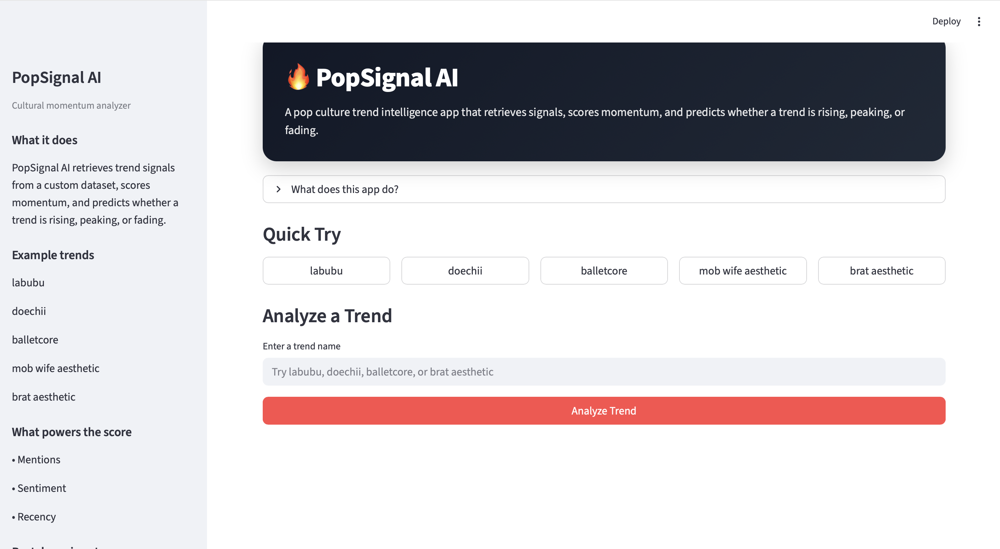
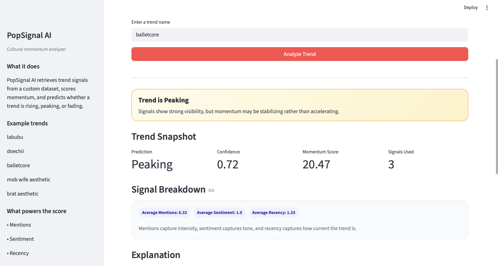

# PopSignal AI

PopSignal AI is an applied AI system that predicts whether a pop culture trend is rising, peaking, or fading. It retrieves relevant trend signals from a custom dataset, scores their momentum using structured logic, and explains each prediction with a confidence estimate.

---

## Original Project Foundation

This project extends my Module 3 project, the Music Recommender Simulation. The original system used scoring rules to recommend music based on user preferences. 

For this final project, I expanded that idea into a full AI system that retrieves cultural signals, evaluates trend momentum, and classifies trends based on real evidence instead of assumptions.

---

## Why This Project Matters

Pop culture trends are usually discussed in vague, subjective ways. PopSignal AI turns that process into a structured system:

- It retrieves real signals before making a decision  
- It scores trends using consistent rules  
- It explains why a trend is rising, peaking, or fading  

This makes trend analysis more transparent, testable, and reliable.

---

## Features

- Retrieval-based trend analysis (RAG-style system)
- Trend classification: Rising, Peaking, or Fading
- Momentum scoring using mentions, sentiment, and recency
- Confidence score for each prediction
- Explanation system that justifies outputs
- Interactive Streamlit web interface
- Automated testing using pytest
- Logging and error handling for reliability


## App Preview

### Home Screen


### Trend Analysis Result
()

---

## Project Structure

```text
popsignal-ai/
├── app.py
├── README.md
├── requirements.txt
├── .gitignore
├── data/
│   └── trend_signals.csv
├── src/
│   ├── retriever.py
│   ├── scorer.py
│   ├── predictor.py
│   ├── explainer.py
│   └── evaluator.py
├── tests/
│   └── test_popsignal.py
└── assets/

## Video Demo

Watch the full walkthrough here:

[PopSignal AI Demo]()

[](assets/assets/PopSignal%20AI%20Trend%20Momentum%20Classifier%20Tool%20%F0%9F%8E%AF.mp4)

Video file: [PopSignal AI Trend Momentum Classifier Tool 🎯.mp4](assets/assets/PopSignal%20AI%20Trend%20Momentum%20Classifier%20Tool%20%F0%9F%8E%AF.mp4)